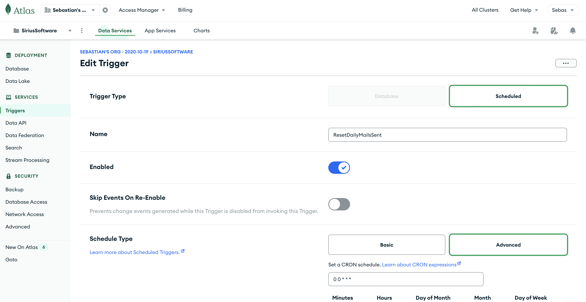
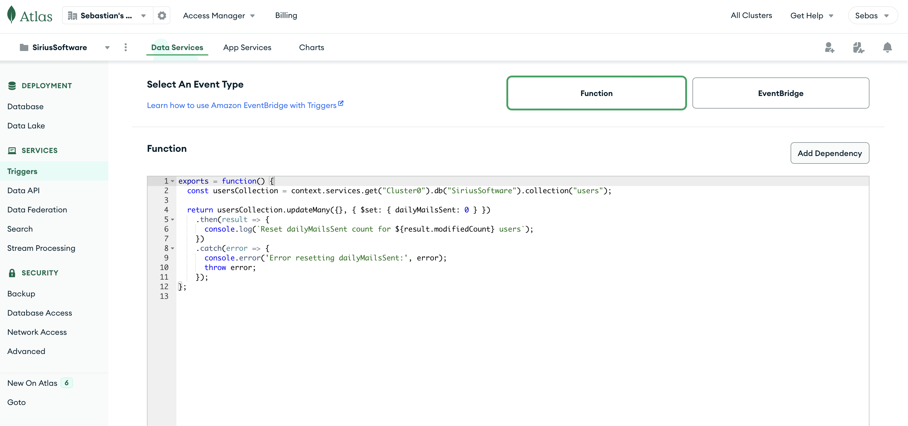

# Backend for Sirius Software challenge

Note: this server assumes that if Sendgrid or Mailgun respond with a `200 Queued` then the mail was sent, even if it's still enqueued on their side.
Note2: on server responses i put some debug comments ((like this)). This would not usually be shown to the user for security purposes

## The project

ExpressJS server that exposes an endpoint to send an email using Sendgrid (or Mailgun as a failover). There's also a daily quota per user to avoid abuse. Limitation: because we use test accounts in this POC for Sendgrid and Mailgun the sender email has to be fixed so it cannot be set to the user's personal email

## Auth

There are two auth routes, the one gives the new user the 'admin' role requires an admin to call it (a JWT token asociated with an admin to be linked to the request).
On register, the new user (with its salted and hashed password and the corresponding role) is persisted in the database to be later fetched on login.
On login, the database is looked for a match. In case of finding one, a JWT token with an expiration of one hour is signed (with username and role inside).
This token is later used in an auth middleware that verifies its validity and expiration date. It then forwards the user, role and token to the protected route. This helps the route check for admin role in case it needs it (like GET /stats does)

## DB

This project uses MongoAtlas' mongodb, accessed via the ODM `mongoose`.
In MongoAtlas a daily trigger is set to reset the quota for every user (runs every day at 24hs UTC-0).

## Daily quota reset

To simplify keeping count of every user's daily mails sent, a cron job is run in Mongo Atlas that resets everyone's count to 0 at midnight UTC-0.

## Setup

- `nvm use`
- `npm i`
- `cp ./.env.template ./.env`
- Fill out ./.env

## Usage

### To run:

- `npm run dev`

### To test:

- `npm test`

## Production

- `npm run build`
- `npm start`

## Backlog

- Logging
- Alerts
- Mongo Atlas
  - ACL (currently just one admin)
  - Backup
- Development/production environments (separate dbs, code branches, mailing service accounts, deployed servers)
- Tests
  - Test login and registration
  - Make some setup independent from mailHandler.spec.ts
- Cleaner user guard implementation
- Deployment

## Challenges

Testing: testing the authMiddleware proved to be difficult as mocking a middleware function seemed to not work reliably. The solution was to decouple the middleware from the authorization using user guards. This way the middleware could be injected with a mocked guard while testing.
